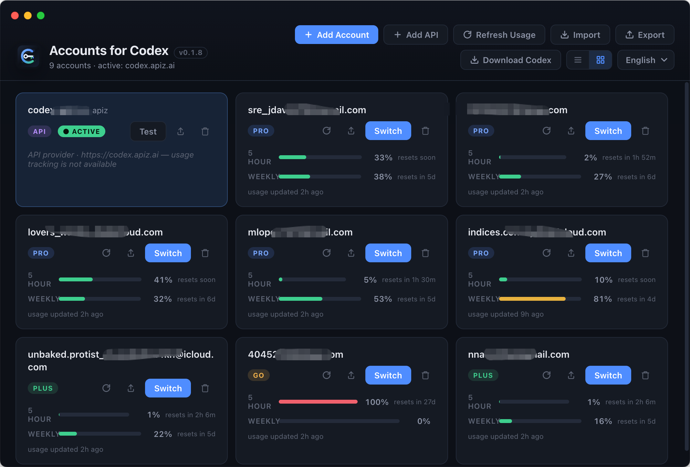
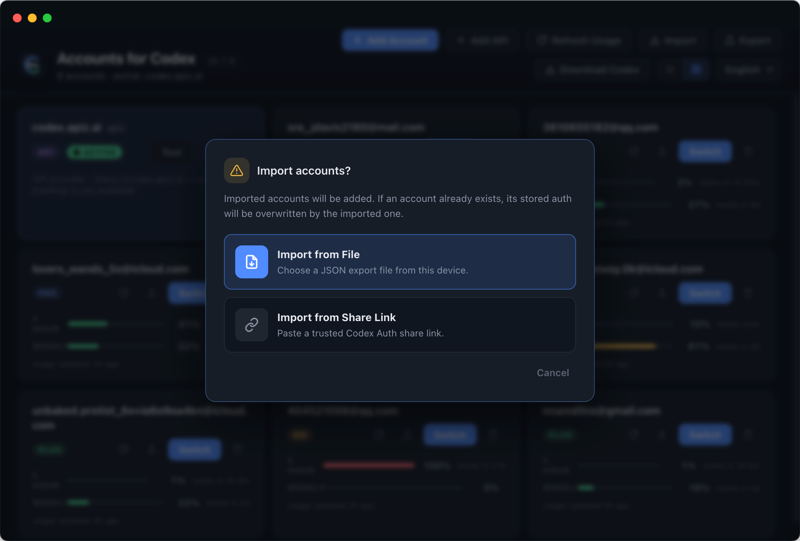
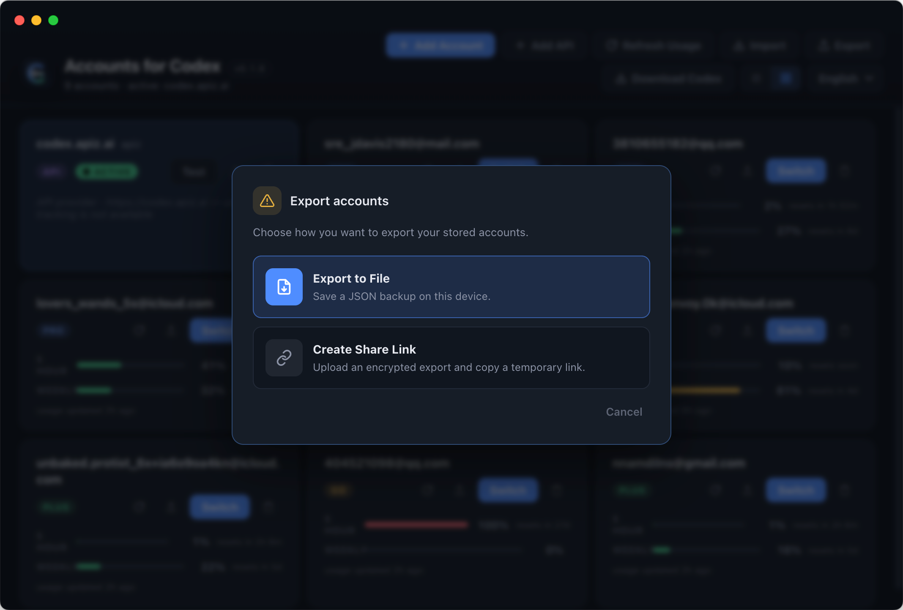

# Accounts for Codex [](https://github.com/xuliang2024/codex-auth/releases/latest) [](https://github.com/xuliang2024/codex-auth/releases)

**Accounts for Codex** is a Tauri desktop app for managing multiple Codex accounts in one place. It gives you a visual account dashboard, usage status, import and export tools, and one-click switching for ChatGPT accounts and custom API providers.



Community: thanks to [LINUX DO](https://linux.do/) for discussion and feedback.

## Highlights

- Manage many Codex accounts from a focused desktop UI.
- Switch the active account with one click.
- Add ChatGPT sign-in accounts and custom API provider accounts.
- Refresh and compare hourly and weekly usage status.
- Import and export account backups from files or trusted share links.
- Use grid or list layouts, language switching, and the built-in Codex download helper.

## Screenshots

### Account Dashboard


### Import Accounts



### Export Accounts



## Install The Desktop App

Download the latest desktop build from [GitHub Releases](https://github.com/xuliang2024/codex-auth/releases/latest).

To run the desktop app from source:

```shell
git clone https://github.com/xuliang2024/codex-auth.git
cd codex-auth/desktop-tauri
npm ci
npm start
```

The desktop app reads the same `~/.codex/accounts/registry.json` account registry as the helper CLI, so accounts added in either place can appear in both.

## Codex Setup

If you need the official Codex CLI for login or terminal use, install it with:

```shell
npm install -g @openai/codex
codex login
```

Supported Codex clients:

- Codex CLI
- VS Code extension
- Codex App

For the official Codex CLI and Codex App, restart the client after switching accounts so the new account is picked up.

## Optional Command Line

The command line remains available for scripting, recovery, and advanced workflows, but the desktop app is the recommended interface.

```shell
codex-auth list
codex-auth login
codex-auth switch
codex-auth import <path>
codex-auth export <dir>
```

Detailed command behavior lives in [docs/commands/README.md](./docs/commands/README.md).

## Codex App Launch Helper

`codex-auth app` is experimental. It launches the official Codex App with managed account-switching settings and may change as the upstream Codex App and Codex CLI change.

See [`docs/commands/app.md`](./docs/commands/app.md) for the current behavior.

## Notes

- Only import account backups or share links from sources you trust.
- Usage refresh can use API-backed data or local Codex session files, depending on command options and account type.
- This project is provided as-is and use is at your own risk.

## Uninstall

Remove the npm helper package:

```shell
npm uninstall -g @loongphy/codex-auth
```
