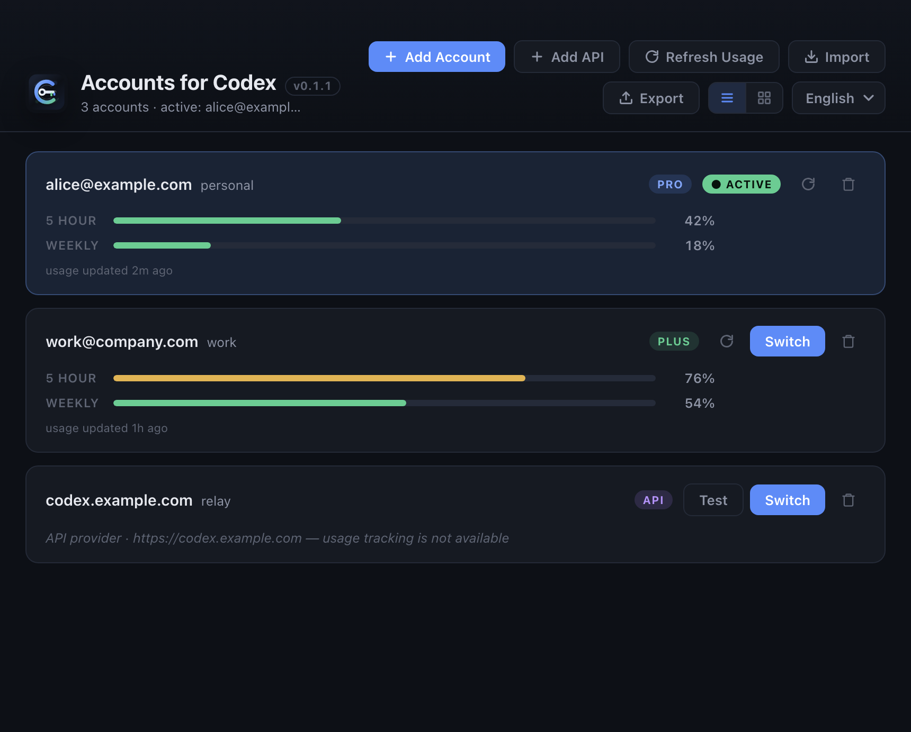

# Codex Auth [](https://github.com/xuliang2024/codex-auth/releases/latest) [](https://github.com/xuliang2024/codex-auth/releases)


`codex-auth` is a command-line tool and desktop app for switching Codex accounts.

## Install

Install with npm:

```shell
npm install -g @loongphy/codex-auth
```

You can also run it without a global install:

```shell
npx @loongphy/codex-auth list
```

## Supported Platforms

`codex-auth` works with these Codex clients:

- Codex CLI
- VS Code extension
- Codex App

> [!IMPORTANT]
> For **Codex CLI** and **Codex App** users, switch accounts, then restart the client for the new account to take effect.
>
> If you want seamless automatic account switching without restarting, use the forked [`codext`](https://github.com/Loongphy/codext), an enhanced Codex CLI.
>
> Install it with `npm i -g @loongphy/codext` and run `codext`.
>
> Codex App users can use `codex-auth app`, but it is not stable. See [Details](#codex-app).

Install the Codex CLI even if you mainly use the VS Code extension or the App, because it makes adding accounts easier:

```shell
npm install -g @openai/codex
```

After that, you can use `codex-auth login`, `codex-auth login --device-auth`, or `codex-auth login --api --base-url <url> --key <api-key>` to sign in and add accounts more easily.

## Desktop App

The **Accounts for Codex** desktop app provides a visual account switcher with usage bars, one-click switching, and support for both ChatGPT sign-in and custom API providers.



Install dependencies and start the app from the repository:

```shell
cd desktop
npm install
npm start
```

The desktop app requires the `codex-auth` CLI on your `PATH` (for example via `npm install -g @loongphy/codex-auth`). It reads the same `~/.codex/accounts/registry.json` as the CLI, so accounts you add in either place show up in both.

## Commands

Detailed command documentation lives in [docs/commands/README.md](./docs/commands/README.md).

> [!NOTE]
> This documentation is based on **v0.3.x**. Some commands described here may not be available in the current release.
>
> To try the latest features, please install the alpha version via:
>
> ```bash
> npm install -g @loongphy/codex-auth@next
> ```
> 
> If you want to downgrade to **v0.2.x**, you may need to manually update the `~/.codex/accounts/registry.json`:
>
> ```json
> "schema_version": 3
> ```

### Account Management

| Command | Description |
|---------|-------------|
| [`codex-auth list [--live] [--active] [--api\|--skip-api]`](./docs/commands/list.md) | List stored accounts and usage state |
| [`codex-auth login [--device-auth]`](./docs/commands/login.md) | Run `codex login`, then add the current account |
| [`codex-auth login --api --base-url <url> --key <api-key>`](./docs/commands/login.md) | Add a custom API provider account (endpoint + API key) |
| [`codex-auth switch [--live] [--api\|--skip-api]`](./docs/commands/switch.md) | Switch the active account interactively |
| [`codex-auth switch <query>`](./docs/commands/switch.md) | Switch directly by row number or account selector |
| [`codex-auth remove [--live] [--api\|--skip-api]`](./docs/commands/remove.md) | Remove accounts interactively |
| [`codex-auth remove <query> [<query>...]`](./docs/commands/remove.md) | Remove accounts by selector |
| [`codex-auth remove --all`](./docs/commands/remove.md) | Remove all stored accounts |
| [`codex-auth alias set <query> <alias>`](./docs/commands/alias.md) | Set an alias for an account |
| [`codex-auth alias clear <query>`](./docs/commands/alias.md) | Clear the alias for an account |

### Import and Maintenance

| Command | Description |
|---------|-------------|
| [`codex-auth import <path> [--alias <alias>]`](./docs/commands/import.md) | Import a single auth file or batch import a folder |
| [`codex-auth import --cpa [<path>]`](./docs/commands/import.md) | Import CLIProxyAPI token JSON |
| [`codex-auth import --purge [<path>]`](./docs/commands/import.md) | Rebuild `registry.json` from auth files |
| [`codex-auth export [<dir>]`](./docs/commands/export.md) | Export stored account auth files |
| [`codex-auth export --cpa [<dir>]`](./docs/commands/export.md) | Export CLIProxyAPI token JSON |
| [`codex-auth clean`](./docs/commands/clean.md) | Delete managed backup and stale account files |

### Configuration

| Command | Description |
|---------|-------------|
| [`codex-auth config live --interval <seconds>`](./docs/commands/config.md) | Configure live TUI refresh interval |

## Quick Examples

```shell
codex-auth list
codex-auth list --active
codex-auth switch
codex-auth switch 02
codex-auth remove work
codex-auth import /path/to/auth.json --alias personal
codex-auth login --api --base-url https://codex.example.com --key sk-xxxx --name myapi
codex-auth list --skip-api
```

## Codex App

> [!IMPORTANT]
> The `app` command is **experimental** and may never become a stable feature.
>
> It is designed to enable seamless account switching without restarting the Codex App. By leveraging the `CODEX_CLI_PATH` environment variable, it dynamically injects our managed codext CLI to handle authentication on the fly.
>
> The `app` command is constrained by ongoing changes in the official Codex App and [Codex CLI](https://github.com/openai/codex). It may not always take effect and may also break your app.

| Command | Description |
|---------|-------------|
| [`codex-auth app [--id <id>] [--codex-cli-path <path>]`](./docs/commands/app.md) | Experimental: launch Codex App with detected defaults, CODEX_HOME, CODEX_CLI_PATH, and platform overrides |

Support seamless account switching including:

- New Chat
- Restoring or resuming an existing conversation
- Continuing a previously completed, interrupted, or manually stopped conversation

### Uninstall

Remove the npm package:

```shell
npm uninstall -g @loongphy/codex-auth
```

## Q&A

### Why is my usage limit not refreshing?

API-backed refresh is the default. When you pass `--skip-api`, `codex-auth` reads the newest `~/.codex/sessions/**/rollout-*.jsonl` file instead. Recent Codex builds often write `token_count` events with `rate_limits: null`. The local files may still contain older usable usage limit data, but in practice they can lag by several hours, so local-only refresh may show a usage limit snapshot from hours ago instead of your latest state.

- Upstream Codex issue: [openai/codex#14880](https://github.com/openai/codex/issues/14880)

Run the API-backed default with:

```shell
codex-auth list
```

Run one local-only command with:

```shell
codex-auth list --skip-api
```

Verify with:

```shell
codex exec "say hello"
```

## Disclaimer

This project is provided as-is and use is at your own risk.

**Usage Data Refresh Source:**
`codex-auth` supports two sources for refreshing account usage/usage limit information:

1. **API (default):** The tool makes direct HTTPS requests to OpenAI's endpoints using your account's access token. This enables both usage refresh and team name refresh. `curl` must be available at runtime.
2. **Local-only:** With per-command `--skip-api`, the tool scans local `~/.codex/sessions/*/rollout-*.jsonl` files for usage data and skips team name refresh API calls. This mode is safer, but it can be less accurate because recent Codex rollout files often contain `rate_limits: null`, so the latest local usage limit data may lag by several hours.

**API Call Declaration:**
By using the default API-backed refresh, this tool will send your ChatGPT access token to OpenAI's servers for usage limit and team name refresh. The exact endpoints are:
- `GET https://chatgpt.com/backend-api/wham/usage`
- `GET https://chatgpt.com/backend-api/accounts`

This behavior may be detected by OpenAI and could violate their terms of service, potentially leading to account suspension or other risks. The decision to use this feature and any resulting consequences are entirely yours.
